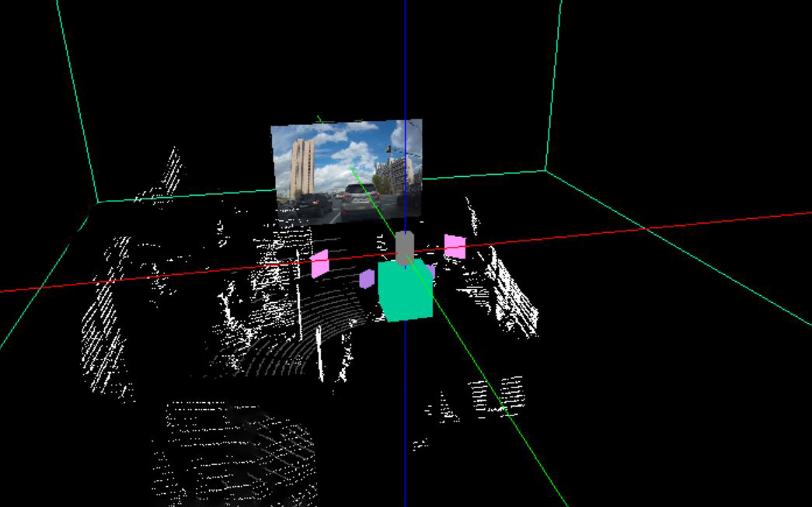

# Визуализация данных с датчиков робота   С# + OpenGL (SharpGL)  Robot sensor data visualisation using  C# and OpenGL (SharpGL)

## Задание

Разработать систему, отображающую параметры работы робота с
использованием средств дополненной реальности. Сделать возможность
ручной установки расположения и склонения сенсоров относительно системы
координат робота. Реализовать возможность создания скриншотов 3D
сцены, а также её запись в видеофайл.

**Порядок обработки:**
- определить пространственную схему размещения сенсорных систем на
роботе;
- выполнить покадровое считывание изображений с камер;
- выполнить получение данных с сенсоров; выполнить получение облака точек с 3D-лидара;
- разработать систему пространственной визуализации данных с
управлением позиции просмотра с клавиатуры и мыши
- реализовать нанесение мониторинговых данных поверх изображения с
учетом схемы размещения виджетов;
- реализовать показ изображений и сохранения их в виде
видеопоследовательности (видеофайла).

**Набор сенсоров:**
1. Камера
2. 3D-лидар
3. Два дальномера

## Результат

//
